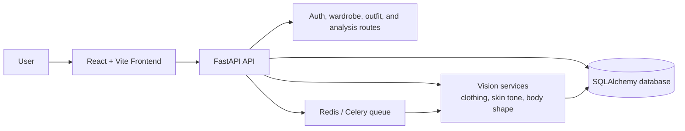

# Fashion App

AI-powered wardrobe intelligence for outfit planning, shopping decisions, discard analysis, and secure user sessions.


## Overview

Fashion App combines a FastAPI backend, a React/Vite frontend, and computer-vision services to help users manage a wardrobe with less guesswork. The app classifies clothing, evaluates color and body-shape compatibility, recommends outfits, flags duplicate purchases, and surfaces items that are no longer pulling their weight.

## Architecture



The backend keeps the API thin and pushes the heavier image-processing work into the service layer so the app can stay responsive when analyzing uploads.

## Tech Stack

### Frontend

- React 19
- React Router
- Vite
- Tailwind CSS
- Lucide React icons

### Backend

- FastAPI
- Uvicorn
- SQLAlchemy
- Pydantic
- SlowAPI for rate limiting
- JWT auth and session tracking

### Vision and AI

- OpenCV
- Ultralytics YOLO pose estimation
- Pillow
- NumPy
- Hugging Face vision models

### Infrastructure

- Docker and docker-compose
- Redis / Celery workers for queued inference jobs
- SQLite for local development, with MySQL or PostgreSQL supported for production

## Features

- Wardrobe uploads with secure image handling
- Clothing classification and color analysis
- Body-shape and undertone checks
- Outfit recommendations
- Shopping purchase recommendations
- Discard analysis for low-value items
- Authenticated user sessions and refresh-token management

## Quick Start

1. Create or update the backend environment file in `backend/.env`.
   - Set `SECRET_KEY`.
   - Set `DATABASE_URL`.
   - Add SMTP settings if you want email delivery during registration.

2. Install dependencies from the repository root.

   ```bash
   pip install -r requirements.txt
   cd frontend
   npm install
   ```

3. Start the backend API.

   ```bash
   npm run backend:dev
   ```

4. Start the frontend in a second terminal.

   ```bash
   cd frontend
   npm run dev
   ```

5. Open the app in your browser and create a wardrobe profile.

## Validation

- Backend tests: `python -m pytest -q backend`
- Frontend lint: `cd frontend && npm run lint`
- Frontend build: `cd frontend && npm run build`

## Project Structure

- `backend/` contains the API, ML services, and database layer.
- `frontend/` contains the React UI.
- `legacy-mobile/` keeps the older mobile app code for reference.
- The repo root includes a few sample image assets used for local testing.

## Contributing

See [CONTRIBUTING.md](CONTRIBUTING.md) for setup, workflow, and pull request guidelines.

## More Docs

- [Quickstart](QUICKSTART.md)
- [Backend setup guide](backend/README.md)
- [Docker setup](DOCKER_SETUP.md)
- [Privacy and security notes](SECURITY_PRIVACY.md)
