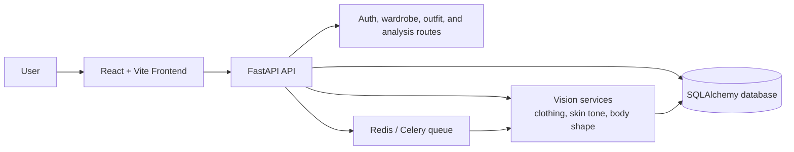

# Fashion App

AI-powered wardrobe intelligence for outfit planning, shopping decisions, discard analysis, and secure user sessions.


## Overview

Fashion App combines a FastAPI backend, a React/Vite frontend, and computer-vision services to help users manage a wardrobe with less guesswork. The app classifies clothing, evaluates color and body-shape compatibility, recommends outfits, flags duplicate purchases, and surfaces items that are no longer pulling their weight.

## Architecture



The backend keeps the API thin and pushes the heavier image-processing work into the service layer so the app can stay responsive when analyzing uploads.

## Tech Stack

### Frontend

- React 19
- React Router
- Vite
- Tailwind CSS
- Lucide React icons

### Backend

- FastAPI
- Uvicorn
- SQLAlchemy
- Pydantic
- SlowAPI for rate limiting
- JWT auth and session tracking

### Vision and AI

- OpenCV
- Ultralytics YOLO pose estimation
- Pillow
- NumPy
- Hugging Face vision models

### Infrastructure

- Docker and docker-compose
- Redis / Celery workers for queued inference jobs
- SQLite for local development, with MySQL or PostgreSQL supported for production

## Features

- Wardrobe uploads with secure image handling
- Clothing classification and color analysis
- Body-shape and undertone checks
- Outfit recommendations
- Shopping purchase recommendations
- Discard analysis for low-value items
- Authenticated user sessions and refresh-token management

## Product Scope

This repo has three intentionally different kinds of work so the roadmap stays readable:

- **Core product:** wardrobe, outfit, shopping, discard, and auth flows are the active product surface.
- **Supporting platform:** feedback collection, metrics, and model retraining are enabled, but they are gated by data volume and infrastructure rather than treated as separate user-facing products.
- **Archived reference:** `legacy-mobile/` is preserved for historical context only and is not part of current delivery.

Operationally, Redis/Celery and the learning pipeline are optional deployment capabilities for smaller hosts, not a sign that the product is unstable or half-finished.

## Quick Start

This repo used to include a GitHub Codespaces dev container, but that setup was removed after the billing change made it no longer worth keeping in the project.

1. Create or update the backend environment file in `backend/.env`.
   - Set `SECRET_KEY`.
   - Set `DATABASE_URL`.
   - Add SMTP settings if you want email delivery during registration.

2. Install dependencies from the repository root.

   ```bash
   pip install -r requirements.txt
   cd frontend
   npm install
   ```

3. Start the backend API.

   ```bash
   npm run backend:dev
   ```

4. Start the frontend in a second terminal.

   ```bash
   cd frontend
   npm run dev
   ```

5. Open the app in your browser and create a wardrobe profile.

## Documentation

### Architecture & Decisions

- **[Architectural Decisions (ADRs)](ARCHITECTURAL_DECISIONS.md)** — Key decisions: FastAPI + React, modular backend, JWT + sessions, vision services layer, etc.
- **[Architecture Diagram](#architecture)** — Data flow and service communication

### Code Quality & Refactoring

- **[Code Quality Refactoring](CODE_QUALITY_REFACTORING.md)** — How we transformed 1770-line monolith into 12 focused modules with 100% type hints
- **[Refactored Codebase Guide](REFACTORED_CODEBASE_GUIDE.md)** — How to add endpoints, patterns, examples
- **[Code Quality Summary](CODE_QUALITY_SUMMARY.md)** — Overview and checklist

### Operations & Monitoring

- **[Monitoring Dashboard Specification](MONITORING_DASHBOARD.md)** — What to chart, alert thresholds, and how to use the existing metrics endpoints
- **[Incident Response Runbook](INCIDENT_RESPONSE_RUNBOOK.md)** — Triage, rollback, and communication steps for outages and model regressions

### Deployment

- **[Production Deployment Runbook](PRODUCTION_DEPLOYMENT_RUNBOOK.md)** — Step-by-step guide: pre-deployment checklist, infrastructure setup (Heroku/AWS/DigitalOcean), database migration, backend/frontend deployment, monitoring, rollback
- **[Free No-Card Deployment](DEPLOYMENT_FREE_NO_CARD.md)** — Deploy to Cloudflare Pages + Hugging Face Spaces + Neon Postgres without a credit card
- **[Docker Setup](DOCKER_SETUP.md)** — Local development with docker-compose

### Testing & Learning

- **[Test Coverage Fix](TEST_COVERAGE_FIX.md)** — How we fixed pytest.ini and added GitHub Actions CI/CD
- **[Learning System Setup](LEARNING_SYSTEM_SETUP.md)** — ML model training and feedback loops

### API Documentation

- **Live Swagger Docs:** Run the backend and visit `http://localhost:8000/docs`
- **ReDoc:** `http://localhost:8000/redoc`

### Other Resources

- **[Contributing Guidelines](CONTRIBUTING.md)** — How to contribute
- **[Security & Privacy](SECURITY_PRIVACY.md)** — Security measures and privacy policy
- **[Legacy Mobile](legacy-mobile/README.md)** — Reference-only React Native scaffold

## Free Public Demo

The best no-card deployment for this repo is a split setup with one public URL:

- Frontend: Cloudflare Pages or GitHub Pages
- Backend API: Hugging Face Spaces Docker Space
- Database: Neon free Postgres

That keeps the app accessible from the repo without requiring visitors to clone it, and it avoids free-tier providers that ask for a credit card.

For the public demo, set these backend env vars on the host:

- `ENV=production`
- `SECRET_KEY=<strong random value>`
- `DATABASE_URL=<free Postgres connection string>`
- `ALLOWED_ORIGINS=<your frontend URL>`
- `EMAIL_VERIFICATION_REQUIRED=false`

For the frontend build, set:

- `VITE_API_BASE_URL=<your backend URL>`
- `VITE_EMAIL_VERIFICATION_REQUIRED=false`

Recommended demo behavior:

- Keep Redis/Celery optional unless your host can run them reliably for free.
- Seed or document a simple demo path so first-time visitors can try the app immediately.
- If you keep user sign-up enabled, the backend can auto-verify accounts in demo mode so SMTP is not required.

Full setup notes are in [DEPLOYMENT_FREE_NO_CARD.md](DEPLOYMENT_FREE_NO_CARD.md).

## Validation

- Backend tests: `python -m pytest -q backend`
- Frontend lint: `cd frontend && npm run lint`
- Frontend build: `cd frontend && npm run build`

## CI/CD

GitHub Actions now runs frontend lint/test/build and backend tests on every push and pull request. Pushes to `main` also package a frontend build artifact and a backend container image for release delivery.

## Project Structure

- `backend/` contains the API, ML services, and database layer.
- `frontend/` contains the React UI (active product surface).
- `legacy-mobile/` is an archived React Native scaffold maintained for reference only—not part of active development. See [legacy-mobile/README.md](legacy-mobile/README.md) for details.
- `backend/tests/fixtures/images/` contains sample test assets (moved from repo root for organization).

## Contributing

See [CONTRIBUTING.md](CONTRIBUTING.md) for setup, workflow, and pull request guidelines.

## More Docs

- [Quickstart](QUICKSTART.md)
- [Backend setup guide](backend/README.md)
- [Docker setup](DOCKER_SETUP.md)
- [Free no-card deployment guide](DEPLOYMENT_FREE_NO_CARD.md)
- [Privacy and security notes](SECURITY_PRIVACY.md)
